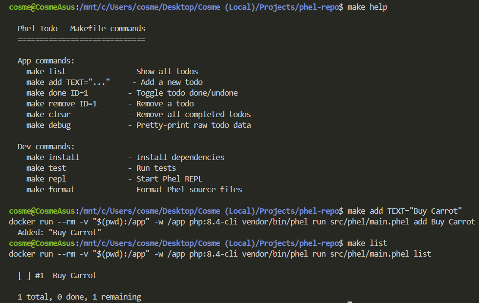
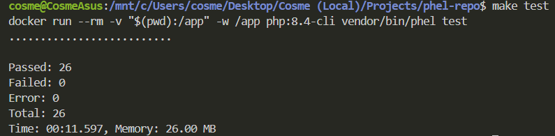

# Phel Todo CLI

A simple command-line task manager built with [Phel](https://phel-lang.org/) — a functional programming language that compiles to PHP.

Built using Phel `dev-main` to exercise the latest features: `defrecord`, `defprotocol`, `defmulti`/`defmethod`, transducers, regex literals, and `pprint`.

## Requirements

- Docker (via WSL on Windows, or native on Linux/Mac)
- `make` (optional, but recommended)

## Setup

```bash
make install
```

## Usage

```bash
make help                       # Show all commands
make add TEXT="Buy groceries"   # Add a todo
make list                       # List all todos
make done ID=1                  # Toggle done/undone
make remove ID=1                # Remove a todo
make clear                      # Remove completed todos
make debug                      # Pretty-print raw data
```

## Development

```bash
make test    # Run tests (26 tests)
make repl    # Start Phel REPL
make format  # Format source files
```

## TODO App working
**TODO app:**



**Tests:**



## DX Feedback

This app was built as an exercise to evaluate the Phel developer experience. See [FEEDBACK.md](FEEDBACK.md) for detailed notes.
